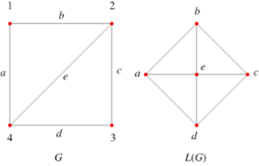

## Street netorks

Until this point the focus has been on networks *between* cities. Now we are turning the focus on networks *within* cities and more specifically on street networks. These are spatial networks whose edges and not only their nodes contain spatial information. To summarise, in spatial or, in other words, geospatial networks:

-   Nodes always contain geographical coordinates.

-   However, edges can:

    -   either contain geographical information (e.g. road networks),

    -   or not, and instead just link two nodes (e.g. social networks whose node's geograpical location is known to us)

Street network analysis is not new. For instance, Leonhard Euler proved that the [Seven Bridges of Königsberg problem](https://en.wikipedia.org/wiki/Seven_Bridges_of_K%C3%B6nigsberg) had no solution. This type of problems and analysis -- routing -- later on became integral part of the standard GIS toolkit.

Why is it important to study street networks:

-   To understand the form of cities. There are quite a few recent studies [e.g. @boeing2019urban; @boeing2017osmnx], but this was also part of an older strand of research called Space Syntax [@hillier1976space].

-   To understand the structure of transportation systems and support transportation planning.

Some key characteristics of street networks:

-   They might have multiple edges between two nodes.

-   Street networks are approximately planar [@boeing2017osmnx].

-   Edges contain geographical information.

Topological measures are important to understand and (maybe compare different) urban street networks.

Try to think what the below topological measures might mean for a street network:

-   Node density

-   Node eccentricity

-   Network diameter

-   Node degree

-   Clustering coefficient

-   Betweenness centrality and its maximum value in a network

-   Closeness centrality

Key development: [*OpenStreetMap*](https://www.openstreetmap.org/#map=6/54.910/-3.432). Known as the Wikipedia for maps, OSM is a collaborative, citizen science project, which allows individuals to contribute in building openly distributed geographic data [@haklay2021contours; @haklay2008openstreetmap]. Through OSM urban analysts have access to street network data from around the world, something which wasn't the case, let's say, 20 years ago.

The below are based on the very helpful vignettes of the [`sfnetworks`](https://cran.r-project.org/package=sfnetworks) and [`osmdata`](https://cran.r-project.org/web/packages/osmdata/) packages. Please make sure to revisit these materials on your own time.

```{r setup, message=FALSE, results='hide', error=FALSE, warning=FALSE}
library(sfnetworks) #tidy geospatial networks
library(sf)         #simple features, spatial data
library(tidygraph)  #tidyverse's version of igraph
library(tidyverse)  #you should know this by now
library(igraph)     #as above
library(osmdata)    #access OSM data
library(dbscan)     #this is the dbscan clustering algorithm

knitr::opts_chunk$set(echo = TRUE) 
```

In geospatial networks:

-   nodes always contain geographical coordinates (`sf` objects),

-   edges can:

    -   either contain geographical information (e.g. road networks)

    -   or not, and instead just link two nodes (e.g. geospatial social networks)


## A first 'toy' example

The below code chunks create and manipulate a toy geospatial network.

```{r}
p1 = st_point(c(7, 51))
p2 = st_point(c(7, 52))
p3 = st_point(c(8, 52))
p4 = st_point(c(8, 51.5))

l1 = st_sfc(st_linestring(c(p1, p2)))
l2 = st_sfc(st_linestring(c(p1, p4, p3)))
l3 = st_sfc(st_linestring(c(p3, p2)))

edges = st_as_sf(c(l1, l2, l3), crs = 4326)
nodes = st_as_sf(c(st_sfc(p1), st_sfc(p2), st_sfc(p3)), crs = 4326)

edges$from = c(1, 1, 3)
edges$to = c(2, 3, 2)
```

As you can see below, `net` has a valid spatial network structure

```{r network}
net = sfnetwork(nodes, edges)
```

We can check it's class:

```{r class}
class(net)
```

And check it characteristics.

```{r check_net}
net
```

Just like `igraph` we can refer to nodes using the `names` we can assign to them.

```{r}
nodes$name = c("city", "village", "farm")
edges$from = c("city", "city", "farm")
edges$to = c("village", "farm", "village")

edges # check the from and to columns 

net = sfnetwork(nodes, edges, node_key = "name")
```

`net`'s edges contain geographical information. So, let's create an `other_net` whose edges do not contain geographical information. This could have been a geospatial social network, for example. We know where each node is located in space and then the edges illustrate the existence of a connection between two nodes. To do so, we simply set the `st_geometry` equal to `NULL`. The plots below will make these differences clear.

```{r}
st_geometry(edges) = NULL
other_net = sfnetwork(nodes, edges, edges_as_lines = TRUE)
```

We can actually plot both example.

```{r plot_toy_net}
plot(net, cex = 2, lwd = 2, main = "Original geometries")
plot(other_net, cex = 2, lwd = 2, main = "Geospatial social network example")
```

## A more 'real' street network

Let's increase the complexity now. We can use the `roxel` data from the `sfnetworks` package. Roxel is a small town just outside Munster in Germany.

The `as_sfnetwork()` function converts the spatial object to a network. So, this is the spatial object and this is how it's geometry looks like.

```{r roxel}
roxel
plot(st_geometry(roxel))
```

Now, we can convert it to a geospatial network and plot it.

```{r roxel_net}
net <- as_sfnetwork(roxel)
plot(net)
```

Instead of `plot()` we can also use `ggplot2` functions. `autoplot()` does what it says.

```{r roxel_ggplot}
autoplot(net) + 
  ggtitle("Road network, Münster Roxel")
```

We have a network, so let's do some network analysis.

First thing we need to do is to *activate* the network component we are interested in. In the below example we want to calculate the betweenness centrality of nodes and, therefore, we need to first activate the nodes.

So, the `net` object now has a `bc` column in the node attributes

```{r betweenness_roxel1, warning=FALSE}
net = net %>%
  activate("nodes") %>%
  mutate(bc = centrality_betweenness()) %>% 
  print() # print() is equal to just run the object, in this case net.
```

We can now create a map of this spatial network, the size and the colour of its nodes are based on their betweenness centrality.

```{r betweenness_roxel2}
ggplot() +
  geom_sf(data = st_as_sf(net, "edges"), col = "grey50") +            
  geom_sf(data = st_as_sf(net, "nodes"), aes(col = bc), size = 1.5) + 
  ggtitle("Betweenness centrality")
```

To better understand the structure of the above `ggplot()` look up `geom_sf()` and `st_as_sf`. If you only run `net` and `st_as_sf(net, "edges")` you can see what was the type of `net` originally and what it was transformed to with the `st_as_sf`.

```{block, type='alert alert-warning'}
**Question**: Can you  interpret betweenness centrality in this context?
```

If we want to get rid of geometries, all we need to do is to remove the geometry. As per base `R`, setting something equal to `NULL` means that we remove it.

```{r roxel_null}
net %>%
  activate("edges") %>%
  st_set_geometry(NULL) %>%
  plot(draw_lines = T, main = "Edges without geometries")

net %>%
  activate("nodes") %>%
  st_set_geometry(NULL) %>%
  plot(vertex.color = "black", main = "Nodes without geometries")
```

## A real world example from Open Street Map

Let's now try to use some real-world data from OSM. The below code extracts the Bristol street data from the OSM API.

To understand the `key` and `value` options, go to OSM's wiki [page](https://wiki.openstreetmap.org/wiki/Map_features#Highway).

Keep an eye on the below. Depending on your internet connections and the OSM's API response time, it might take a couple of minutes. If you get an error message from running the `opq()` try again, it might work the second time as something might have gone wrong the first one. This is not uncommon when we extract data over the internet through an API. Usually such API requests are wrapped up in a `if_else()` function to re-try if the first attempt was unsuccessful.

```{r}
bristol_data <- opq(bbox = 'Bristol') %>%
   # getbb ("bristol uk") %>%
   #  opq () %>%
  add_osm_feature(
    key = 'highway', 
    value = c("motorway", "trunk", "primary", "secondary", "tertiary", "residential", "unclassified", "motorway_link", "trunk_link", "primary_link", "secondary_link","tertiary_link", "residential_link")
) %>% 
  osmdata_sf(quiet = FALSE)

# extract the roads
bristol_roads <- st_geometry(bristol_data$osm_lines)
  
# build the sfnetwork object
bristol_sfn <- as_sfnetwork(bristol_roads, directed = FALSE, length_as_weight = TRUE)

ggplot() +
  geom_sf(data = st_as_sf(bristol_sfn, "edges"), col = "grey50") +
  geom_sf(data = st_as_sf(bristol_sfn, "nodes"), size = .01)
```

Network data wrangling. We need to:

1.  Remove multiple edges and loops. AKA simplifying the networks.

<!-- 2.  Create nodes where two lines intersect. -->

2.  Remove nodes that are interior points in a line and define the shape of the line. AKA smoothing the network.

To keep track of the changes, let's keep a note of the original network size.

```{r size}
# size of original network
gsize(bristol_sfn)  # number of edges
gorder(bristol_sfn) # number of nodes
```

Now we can simplify the network.

```{r simplify}
bristol_wrangled <- bristol_sfn %>%
  activate("edges") %>%
  filter(!edge_is_multiple()) %>%   # Simplify the network
  filter(!edge_is_loop())           # Simplify the network 

# size of simplified network
gsize(bristol_wrangled)  # number of edges
gorder(bristol_wrangled) # number of nodes
```

<!-- Create nodes where two lines intersect. -->

```{r new_intersections, eval=FALSE, include=FALSE}
bristol_wrangled <- convert(bristol_wrangled, to_spatial_subdivision)

# size of simplified network
gsize(bristol_wrangled)  # number of edges
gorder(bristol_wrangled) # number of nodes
```

Remove the interior points...

```{r smooth}
bristol_wrangled <- convert(bristol_wrangled, to_spatial_smooth)

# size of simplified network
gsize(bristol_wrangled)  # number of edges
gorder(bristol_wrangled) # number of nodes
```

... and plot the network again.

```{r}
ggplot() +
  geom_sf(data = st_as_sf(bristol_wrangled, "edges"), col = "grey50") +
  geom_sf(data = st_as_sf(bristol_wrangled, "nodes"), size = .01)
```


```{r, eval=FALSE, include=FALSE}
node_coords <- bristol_wrangled %>%
  activate("nodes") %>%
  st_coordinates()

clusters <- dbscan(node_coords, eps = .0001, minPts = 1)$cluster # eps should be small, this is why it wasn't working

# Add the cluster information to the nodes of the network.
clustered <- bristol_wrangled %>%
  activate("nodes") %>%
  mutate(cls = clusters)

clustered <- clustered %>%
  mutate(cmp = group_components())

select(clustered, cls, cmp)

contracted = convert(
  clustered,
  to_spatial_contracted,
  cls, cmp,
  simplify = TRUE
)

ggplot() +
  geom_sf(data = st_as_sf(contracted, "edges"), col = "grey50") +
  geom_sf(data = st_as_sf(contracted, "nodes"), size = .01)
ggsave("contracted.png")

ggplot() +
  geom_sf(data = st_as_sf(bristol_wrangled, "edges"), col = "grey50") +
  geom_sf(data = st_as_sf(bristol_wrangled, "nodes"), size = .01)
ggsave("wrangled.png")
```

## Network measures

Now we can calculate betweenness centrality for Bristol, using the OSM street network we acquired.

```{r bristol_betweenness}
bristol_wrangled <- bristol_wrangled %>%
  activate("nodes") %>%
  mutate(bc = centrality_betweenness())

ggplot() +
  geom_sf(data = st_as_sf(bristol_wrangled, "edges"), col = "grey50") +
  geom_sf(data = st_as_sf(bristol_wrangled, "nodes"), aes(col = bc,   
                                                          alpha = bc), # Increase opacity based on betweenness...
          size = 1) + 
  guides(alpha=FALSE) +                                                # ...but exclude this from the legend. Remove this line to see what will happen
  ggtitle("Betweenness centrality in Bristol")
```

```{block, type='alert alert-warning'}
**Question**: How can we interpret this map?
```

Remember the community detections algorithms? We can detect such communities within the street network. These are neighbourhoods of **streets** which are better connected internally than externally with the whole network. There is a contradiction here, no? Community detection is about nodes, not edges? However, here we are interested in clustering edges. So, we wiil do a trick. We first 'inverse' our spatial network, which means that the nodes become edges and vice versa. We do this with `morph(to_linegraph)`. Read the Wikipedia entry of [line graps](https://en.wikipedia.org/wiki/Line_graph) and see teh below image for an example. The `unmorgh()` brings the changes -- that is the new `group` column back to the original network, that we now call `grouped_net`. For more details, have a look [here](https://cran.r-project.org/web/packages/sfnetworks/vignettes/sfn05_morphers.html).



<small>Source: [mathworld.wolfram.com](https://mathworld.wolfram.com/LineGraph.html)</small>

```{r}
grouped_net = bristol_wrangled %>%
  morph(to_linegraph) %>%
  mutate(group = group_louvain()) %>%
  unmorph()

# A new group column has been added with the community membership
grouped_net

# There are quite a few communities overall
grouped_net %>%
  activate("edges") %>%
  pull(group) %>%
  unique() %>%
  length()

grouped_net %>%
  activate("edges") %>%
  st_as_sf() %>%                                     # If you remember, we used this above.
  transmute(group = as.factor(group)) %>%            # We turn community membership to a factor.
  filter(group %in% c(1:15)) %>%                     # Only plotting the first 15 communities.
  ggplot() +
  geom_sf(aes(col = group), lwd = 4) +               # This plots the communities ...
  geom_sf(data = st_as_sf(bristol_wrangled, "edges"),# ... and this all the network.
          col = "grey", lwd = 0.5, alpha = 0.4) +
  theme(legend.position="none") +
  ggtitle("Bristol's street communities")            # No legend please.
```

```{block, type='alert alert-warning'}
**Task**: Read the [routing vigneette](https://cran.r-project.org/web/packages/sfnetworks/vignettes/sfn04_routing.html) of `sfnetworks and apply these techniques in the Bristol street network.
```
