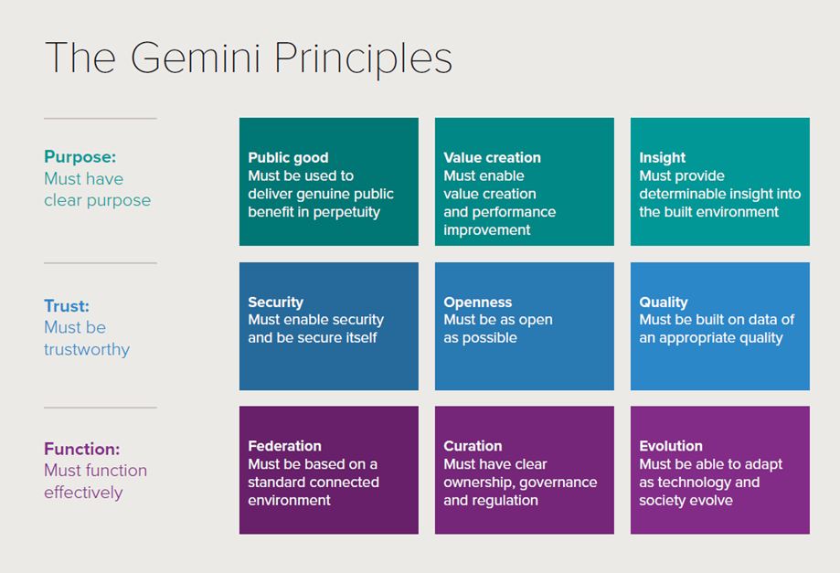

```{r}
#| label: setup
#| echo: false
#| results: false
#| include: false

library(rprojroot)

# This is the project path
path <- find_rstudio_root_file()
images.path <- paste0(path, "/images/")
```

## Outline

-   Big data vs. just data

-   Smart city

-   Urban dashboards

-   Digital twins

-   Artificial intelligence in cities

## Big data vs. just data

-   Digital traces human activities leave behind

-   Accidental [@arribas2014accidental]

-   Why?

-   Computing power

-   Digital turn

-   Geospatial technologies \[*important for urban researchers*\]

## Big data vs. just data

::: r-fit-text
-   **Volume** \[how big is big?\]

-   **Velocity**, being created in or near real time

-   **Variety**, being structured and unstructured in nature

-   Exhaustive in scope, capture entire populations or systems

-   Fine-grained in resolution

-   Relational in nature, common fields that enable the merging of different data sets

-   Flexible, extensionable (can add new fields easily) and scalable (can expand in size rapidly) [@kitchin2013big].

Or, whatever doesn't fit in an excel spreadsheet (Batty, anecdotal)
:::

## Big data vs. just data

-   Biases

-   Need for new methods

-   Accidental

-   *Big data can speak for themselves*. Not really [@kitchin2013big]

## Smart cities, different approaches

The **digital technologies** approach

-   Urban infrastructure and services are managed computationally

-   Networked digital instrumentation embedded into the urban fabric

-   Continuous streams of data that dynamically feed into management systems and control rooms

-   New forms of governmentality

::: footer
Based on @kitchin2019timescape
:::

## Smart cities, different approaches

The **outputs** approach

-   Strategic use of information and communications technology (ICT)

-   ➔ smarter citizens, workers, policy, and programs

-   ➔ innovation, economic development, and entrepreneurship

-   ➔ urban resilience and sustainability

::: footer
Based on @kitchin2019timescape
:::

## Smart cities, different approaches

The **just** approach

-   ICT-led, citizen-centric model of development

-   ➔ social innovation and social justice, civic engagement and activism

-   ➔ transparent and accountable governance

::: footer
Based on @kitchin2019timescape
:::

## Smart cities, different approaches

In reality...

... a blend of all these approached

Rio de Janeiro, Brazil: The first *smart city*


<small> Source: [Centro De Operacoes Prefeitura Do Rio](http://cor.rio/) </small>

## Smart cities, different approaches

Rio, ten years on: a critical postscript

-   Built by IBM/Cisco in 2010 and marketed globally as *the* smart-city control room

-   Since criticised as **"surveillance theatre"** and a flawed model of smart-city emergence [@gaffney2016smarter]

-   Centralised, real-time monitoring did not straightforwardly translate into better everyday urban outcomes for residents; political priority and investment have since receded

-   Take-away: a control room tells us about **power and visibility**, not automatically about better governance -- keep this in mind for AI-powered versions of the same idea, later in this lecture

## Smart cities and data

-   (Smart) cities generate much more data nowadays

    -   e-government systems, city operating systems, centralized control rooms, digital surveillance, predictive policing, intelligent transport systems, smart grids, sensor networks, building management systems, civic apps ... [@kitchin2021fragmented]

## Smart cities and data

-   Local authorities are under pressure to release open data for:

    -   public scrutiny

    -   civic apps

-   Data reuse:

    -   internally facing

    -   externally facing

## Dashboards

> A visual display of the most important information needed to achieve one or more objectives; a consolidated and arranged on a single screen so the information can be monitored at a glance [@few2007dashboard]

## Dashboards

-   Transparency, open government philosophy, accountability [@young2022building]

-   Improve user's 'span of control of large and complex data

-   Share outputs

## Dashboards

-   Not just neutral, technical tools

-   Translators and engines rather than mirrors

-   Reductive in nature (vs. the complex nature of cities)

-   Decontextualize cities [@kitchin2016praxis]

## Bristol dashboard

<!-- <iframe src="https://citydashboard.org/london/" width="850" height="500" frameBorder="0" scrolling="yes"> -->
<iframe src="https://experience.arcgis.com/experience/bcf5a6312bc04ffeb43db67cd57f5439" width="900" height="500" frameBorder="0" scrolling="yes">

</iframe>

<!-- <small><small> Source: <https://citydashboard.org/london/> </small></small> -->
<small><small> Source: <https://experience.arcgis.com/experience/bcf5a6312bc04ffeb43db67cd57f5439/> </small></small>

## NYC Dashboard

<iframe src="https://datausa.io/profile/geo/new-york-ny" width="900" height="500" frameBorder="0" scrolling="yes">

</iframe>

<small><small> Source: <https://datausa.io/profile/geo/new-york-ny> </small></small>


## Digital twins

::: r-fit-text
> A mirror image of a physical process that is articulated alongside the process in question, usually matching exactly the operation of the physical process which takes place in real time

> A variety of digital simulation models that run alongside real-time processes that pertain to social and economic systems as well as physical systems

<br>
Models are simplifications not replications of the real thing

::: footer
Based on @batty2018digital
:::
:::

## Digital twins

<!--  -->

<!-- <small><small> Source: <https://webinars.sw.siemens.com/en-US/digital-twin-in-manufacturing/> </small></small> -->

 <small><small> Source: [@bolton2018gemini] </small></small>

## Digital twins: a concrete (and partial) example

**Bristol Harbour digital twin** (Mott MacDonald, for Bristol City Council)

-   UAV, uncrewed surface vessel and LiDAR surveys of 300+ assets across 21km of waterway

-   Over 1 terabyte of point-cloud, mesh and photographic data, accessed through a web platform for remote condition assessment and deterioration tracking

-   Genuinely useful: replaces some in-person inspections; supports year-on-year change detection

## Digital twins: a concrete (and partial) example

But go back to Batty's definition: *"matching exactly the operation of the physical process which takes place in real time"* [@batty2018digital]

-   The harbour twin is built from **periodic surveys**, not a continuous real-time sensor feed

-   It is closer to a very detailed, repeatedly-updated 3D model than to a live "mirror world"

-   Discussion: how many self-styled digital twins you encounter in practice will actually meet Batty's definition, rather than borrowing its name?

-   This gap between claim and practice is not unique to Bristol: a systematic review of urban digital twins finds most implementations fall well short of the "live, bidirectional" ideal [@weil2023urban]

## Artificial intelligence in cities

-   So far: *data* as the raw material of smart cities

-   Now: **AI**, and especially **generative AI**, as the tool increasingly used to make sense of, and act on, that data

-   Narrow AI / machine learning is not new to this unit -- you have already used it (k-means, Poisson regression)

-   What *is* new since c. 2022 is **generative AI**: large language models (LLMs) such as ChatGPT, Claude, Gemini and Copilot, which can read, write, summarise, code and (increasingly) reason over text, and, with the right tools attached, over spatial and tabular data too

-   These LLMs are one instance of a broader shift towards **foundation models**: models pretrained on very large, broad data and then adapted to many downstream tasks [@bommasani2021opportunities]

::: footer
See also @batty2026after, reflecting on AI from within this unit's own home journal
:::

## AI applications for cities: some examples

-   **Planning practice**: drafting and summarising planning applications, synthesising public consultation responses, generating scenario narratives for local plans [@zheng2025urban; @liu2025large]

-   **Citizen-facing services**: e-government chatbots, 311/multilingual service requests, accessibility of council information [@cortescediel2023trends]

-   **Urban monitoring**: computer vision on street-level and satellite imagery (e.g. detecting pavement damage, green space, informal settlements) -- building on the kind of street-level imagery reviewed in @biljecki2021street

-   **Mobility and infrastructure**: demand forecasting, predictive maintenance, incident detection layered on top of the dashboards you have just seen

-   **Digital twins**: generative models increasingly used to simulate "what if" urban scenarios inside twins, rather than just visualising current conditions, like the harbour twin above [@weil2023urban]

-   **Research and analysis** (relevant to *your* assessment): AI-assisted coding, literature scanning, exploratory data analysis

## AI's own urban footprint

AI is not just applied *to* cities -- it also physically *lives* in them

-   Every LLM query runs on a data centre somewhere: real buildings, with real electricity, water and land demands

-   Recent evidence: almost all US data centres sit *within or close to existing urban areas*, drawn there by pre-existing power grids and fossil-fuel industrial infrastructure, not built on empty land [@ancona2026urban]

-   This is a **location-economics question**, not just a technology one -- think back to agglomeration economies and von Thünen from Lecture 1: AI infrastructure clusters where power, fibre and cooling are already cheap and available

-   More broadly, economic geographers are now asking how AI itself *predicts, prescribes and programs* economic futures -- reshaping labour, geopolitics and regional development unevenly across places [@zook2026economic]

-   So: the "cloud" has a location, a landlord, and a local planning application

## LLMs in urban planning: what the evidence says so far

-   A rapidly growing literature since 2025: @zheng2025urban (*Nature Computational Science*) and @liu2025large (*Journal of Urban Technology*) both map current capabilities and limits

-   Capabilities: accelerating routine drafting and synthesis tasks; lowering the barrier to engaging with technical/GIS outputs; supporting scenario generation

-   Limits: shallow grounding in local context, plan-making regulation and community history; risk of confidently wrong ("hallucinated") outputs; still largely unproven in real, contested planning decisions

-   Recurring theme: AI as **augmentation** of planners' judgement, not (yet, or perhaps ever) a substitute for it

## A critical perspective: whose city does the algorithm see?

-   Recall Kitchin's three approaches to smart cities from earlier in this lecture: **digital technologies**, **outputs**, **justice** [@kitchin2019timescape]

-   AI intensifies all three: more automated infrastructure, more claims of efficiency/innovation gains, but also new governance questions -- and, as with Rio, new versions of the control-room logic, now AI-powered

-   @tedeschi2024datafication: datafication (now increasingly AI-mediated) can produce new forms of urban **(in)justice** -- whose data trains the model, whose behaviour it optimises for, who is legible to it and who is not

-   Practical risks: bias and unequal error rates across neighbourhoods/groups; opacity and unaccountability of automated decisions; labour and environmental costs of large models (see the data centre point above); over-trust in fluent-sounding but wrong outputs

## Big data (and now AI) cannot speak for themselves

-   Recall from earlier: *"Big data can speak for themselves. Not really"* [@kitchin2013big]

-   The same applies, arguably even more so, to AI: a fluent answer is not the same as a *correct* or *contextually appropriate* one

-   Your task, in this unit and beyond, is the same whether the tool is a GLM or an LLM: use it critically, understand what it is actually doing, and be able to justify your methodological

## References {.scrollable}
